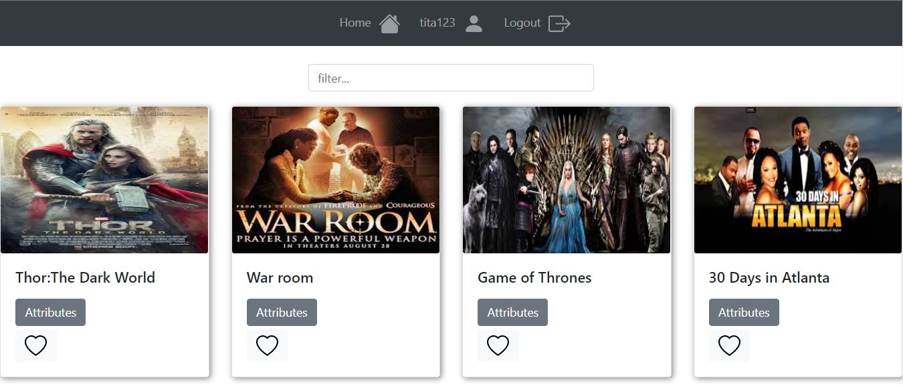

# myFlix_client

The myFlix_app is an app that consumes the  and displays movies.Being a fullstack app, users can register accounts, view a catalogue of movies, select their favourite movies and have have an expereience of the rich view and features of the app.More on the features below.

## Built With

- MERN
- React boostrap 2.4.0,
- React Redux 8.0.2

## Live Demo

## Getting Started

To get a local copy up and running follow these simple example steps.

### Prerequisites

Node Js(npm)

### Setup

- run npm install to install all dependencies

### Usage

- npm run start

### Deployment

- npm run deploy

## Key Features

- Welcome page where users can either log in or register
- A movie page where user can view all movies once authenticated
- Upon clicking on a particular movie, users will be taken to a single movie view, where
  additional movie details will be displayed. The single movie view will contain the following
  additional features:
  - A button that when clicked takes a user to the director view, where details about the
    director of that particular movie will be displayed.
  - A button that when clicked takes a user to the genre view, where details about that
    particular genre of the movie will be displayed.

## Technical Requirements

- Written in Angular (version 9 or later)
- The application requires the latest version of Node.js and npm package
- The application must contain user registration and login forms
- The application must be designed using Angular Material
- The application's codebase must contain comments using Typedoc
- The project must contain technical documentation using JSDoc
- The project must be hosted on GitHub Pages

## Author

👤 **Tommy Tabe**

- Github: [@tabetommy](https://github.com/tabetommy)
- Twitter: [@twitterhandle](https://twitter.com/twitterhandle)
- Linkedin: [Tommy egbe](https://www.linkedin.com/in/tommy-egbe-304464116/)

## 🤝 Contributing

Contributions, issues and feature requests are welcome!

Feel free to check the [issues page](issues/).
